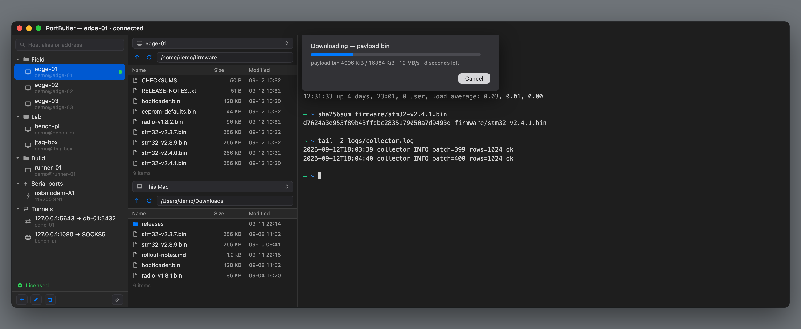

<!-- 공개 저장소(portbutler-releases)의 README 원본.
     **여기서 관리하고 릴리스할 때 복사한다** — 저장소 두 곳에 따로 두면 한쪽만
     고치게 되고, 홍보 문구가 실제 기능과 어긋나는 것이 가장 나쁘다.

     함께 복사할 것 (공개 저장소 기준 경로):
       docs/mascot.png     ← apple/assets/mascot.png
       docs/icon.png       ← apple/build/preview-512.png
       docs/hero.png       ← docs/release/assets/hero.png
       docs/feat-drag.png  ← docs/release/assets/feat-drag.png
       docs/feat-cred.png  ← docs/release/assets/feat-cred.png
       docs/connect.png    ← docs/release/assets/connect.png
       docs/feat-xfer.png  ← docs/release/assets/feat-xfer.png

     **화면 이미지는 캡처가 아니라 재구성이다.** 어디까지가 실물인지는
     docs/release/assets/README.md 와 각 PNG 옆의 .meta.json 에 있다. 화면이
     바뀌면 이미지도 함께 고칠 것 — 소스는 assets/sources/*.html 이다.

     **앵커의 하이픈 둘은 오타가 아니다.** GitHub은 제목에서 구두점을 지우고
     공백을 하이픈으로 바꾼다 — "Speed, measured — not quoted"는 em 대시가
     사라지고 양옆 공백이 남아 `#speed-measured--not-quoted`가 된다. 하나로
     줄이면 상단 Benchmarks 단추가 아무 데도 가지 않는다.

     **수치를 고칠 때는 docs/BENCHMARK.md를 먼저 고칠 것.** 여기 있는 값은 전부
     그 문서에서 온 실측값이고, 홍보 문구가 근거보다 앞서가면 되돌릴 수 없다. -->

<p align="center">
  
</p>

<h1 align="center">PortButler</h1>

<p align="center">
  <b>Native SSH, SFTP and serial for macOS — in one window.</b>
</p>

<p align="center">
  <a href="https://portbutler.sshlab.dev"><b>portbutler.sshlab.dev</b></a>
  &nbsp;·&nbsp;
  <a href="https://github.com/Higangssh/portbutler-releases/releases/latest"><b>↓ Try it free for 14 days</b></a>
  &nbsp;·&nbsp;
  <a href="https://buy.polar.sh/polar_cl_4mYTJiLTIaCf0evHlowBRXriGMT2doIQmfZL30FOvhW">$29 once, if you keep it</a>
  &nbsp;·&nbsp;
  <a href="#pricing">Pricing</a>
  &nbsp;·&nbsp;
  <a href="#how-it-compares">Compare</a>
  &nbsp;·&nbsp;
  <a href="#speed-measured--not-quoted">Benchmarks</a>
</p>

<p align="center">
  
  
  
  
  
</p>

<br>

<p align="center">
  
</p>


<p align="center">
<i>Pick a host on the left and it opens as a <b>tab in this window</b>.<br>
Five machines means five tabs — not five windows.</i>
</p>

---

## Why another SSH client?

Most SSH clients make you choose: a terminal that cannot move files, or a file
manager that cannot give you a shell. And none of them speak to the USB-serial
adapter on your desk.

PortButler puts all three in one window — and it does five things that the
others do not.

<br>

### 1 · It is measurably faster at moving files

**Downloads run at 108 MB/s over gigabit, where `scp` gets 74.**

Same Mac, same server, same 64MB file, **downloading**:

| Download | Raspberry Pi 5 over 1GbE | Same machine (no wire limit) |
|---|---|---|
| **PortButler** | **108 MB/s** | **465 MB/s** |
| `scp` | 74 MB/s | 267 MB/s |
| `sftp` | 74 MB/s | 267 MB/s |
| | **1.45×** | **1.74×** |

The reason is not micro-optimisation. It is the shape of the transfer:

```
scp / sftp     [req]→ ⋯wait⋯ ←[data]  [req]→ ⋯wait⋯ ←[data]
               32 KiB per round trip, 0.43 ms each
               ceiling = 32 KiB ÷ 0.43 ms ≈ 74 MB/s

PortButler     [req][req][req][req] → responses interleave back
               4 streams · 256 KiB chunks · each written in place
```

**Round-trip latency is the ceiling**, and `scp` sits exactly on it — its
measured 74 MB/s matches the calculated limit, which is how we know the
explanation is right.

**The gap widens with distance.** A server on the other side of the world
(200 ms) leaves a sequential transfer crawling; a parallel one barely notices.

**Uploads are not faster. They match `scp`** — we measure 74 MB/s over the same
gigabit link, the same as `scp` and `sftp`. Reading a file is where several
requests can be in the air at once. Writing one is not: writing to several
places in a remote file at the same time leaves a **hole-ridden file** if the
transfer is cut off, and we would rather be slow than hand you a firmware image
with a gap in it. Until that is handled properly the upload path stays
sequential, and we do not claim otherwise.

<p align="center">
  
</p>

<p align="center">
<i>The rate is on screen while it runs — megabytes per second and the time
left, in the same units as the table above.</i>
</p>

**And when a big one dies at 90%, it picks up from there.** A dropped Wi-Fi or
a closed lid leaves `firmware.bin.portbutler-part`, and the next attempt asks
whether to resume it. It never resumes silently — the piece on disk could be
from a different file — and it never starts over silently either, which would
make the feature pointless.

Parallel downloads make this harder than it sounds: four streams write to
different offsets, so an interrupted piece has **holes in it**. Resuming from
the file's size would treat zeroed gaps as received data and append past them.
PortButler tracks each stream separately and keeps only the contiguous prefix —
the part that is genuinely there.

<p align="center">
  
</p>

<p align="center">
<i>Two file panes, either one remote or local. Drag a file from one to the other
— or sort by a column and move it without touching the mouse.</i>
</p>

#### Against other SFTP clients

`scp` is the baseline everyone has. Here is where we sit against the clients
people actually shop against — compared on **wire-unconstrained conditions**,
because that is the only way the client's own code is what is being measured:

| | Download | Upload |
|---|---|---|
| **PortButler** | **465 MB/s** | 267 MB/s |
| WindTerm 1.72 | 216 MB/s | 247 MB/s |
| FileZilla | 161 MB/s | 172 MB/s |
| WinSCP | 64 MB/s | 57 MB/s |

**Read this as orders of magnitude, not a precise ranking.** Ours is an Apple
silicon Mac; the others were published on Windows 10 with a 2.3 GHz Core i5, so
the machines differ. We include it because the alternative — leaving it out —
tells you less, and because the shape of the result matches the mechanism:
clients that pipeline requests land in the hundreds, clients that do not land
near `scp`. [Their published figures](https://kingtoolbox.github.io/2023/11/15/benchmark-sftp-transfer/)

**Why not compare on gigabit?** WindTerm's 216 MB/s cannot happen on a 1GbE
wire (max 119 MB/s), so it was measured on a faster link or inside one machine.
Putting our 108 MB/s beside it would make us look half as fast while actually
comparing *cables*, not code.


<br>

### 2 · It tells you *why* a connection failed

`connection failed` is not an error message. These five look identical and need
completely different fixes:

| What happened | What PortButler tells you |
|---|---|
| Port refused the connection | The machine is up. Check the port — many devices use 2222 |
| No answer at all | Powered off, or a firewall dropping packets silently |
| Name will not resolve | Check spelling, or whether it only exists on a VPN |
| Connected, but no SSH greeting | That port is not SSH, or `sshd` is stuck |
| Something answered, but not SSH | Check the port — a web server may be sitting there |

<br>

### 3 · It does not lock you out of your own accounts

Servers count failed logins. `MaxAuthTries` disconnects you, `pam_faillock`
locks the account, and `fail2ban` blocks your whole IP — which locks you out of
**every** account on that machine.

Most clients cheerfully offer every key in your agent, burn through the
allowance, and get cut off **before you are ever asked for a password**.

PortButler counts too. It offers **at most four public keys**, so an attempt is
always left for a password. It skips methods the server says it will not accept,
warns before a password attempt that could lock the account, and spaces out
reconnects.

<p align="center">
  
</p>

<p align="center">
<i>And when the far side asks for a password, the list opens over the prompt —
type to filter, Return to send. The password comes from the Keychain; it is
never shown and never typed again.</i>
</p>

<br>

### 4 · A tunnel is a session, not a side effect

Everywhere else a port forward is a checkbox on a host, so it dies with the
terminal it was riding on. Here it is **its own item in the list**, next to your
servers — open a port for the afternoon with nothing attached to it.

It does not ask you for the address, account or key a second time. It points at
a host you already saved, so `local:5163 → device → pi → workstation:5163` is
one rule plus "go through `pi`" — because `pi` already knows it goes through
`device`. Change that password next month and the tunnel follows.

| State | Local port | Goes to | Open now | Moved |
|---|---|---|---|---|
| open | 5163 | `workstation:5163` | 2 | 3.2 MB |
| blocked | socks 1080 | whatever connects | — | — |

**Watch the last column.** A tunnel that is open and idle looks exactly like one
that is quietly broken — both are a green dot. Termius keeps standalone
forwarding rules too, but [its documentation](https://docs.termius.com/organize-and-connect-to-hosts/port-forwarding-and-tunneling)
describes only their on/off state. The bytes are how you tell the difference,
and they are the reason this screen exists.

---

### 5 · It remembers what you typed, where there is nothing to remember it

Some consoles remember nothing at all — a bootloader, a bare MCU prompt, a
stripped BusyBox build. Others remember a little and then throw it away: **Cisco
IOS keeps ten lines by default, and they die with the session.** Pull the cable,
come back after lunch, and it is gone. None of it is on your Mac, none of it is
searchable, and none of it survives a power cycle — which, on a bench, it will
get. So an engineer types `show interface gigabitethernet 0/1` by hand, forty
times a day.

PortButler keeps what you have typed on that port and offers the rest of a line
in grey, ahead of the cursor. **→ accepts it. Nothing else changes** — with no
suggestion showing, → is just → and goes to the device like any other key. It
switches itself off inside `vim` and `less`, where a phantom character would be
worse than useless.

It works over SSH too, and there it is a convenience rather than a first: the
shell you land in often does this already. **This is not a shell plugin** like
`zsh-autosuggestions` — those run inside the shell, and on a switch, a bootloader
or an MCU there is no shell to put one in. Ours runs on this side of the cable,
so what it remembers is yours, per host, and still there next week.
If a remote shell is already suggesting, you will see two — turn ours off for
that host with **File ▸ Suggest Commands Here**.

**Passwords are never remembered, and two separate rules make sure of it.** A
password prompt is caught because the console stops echoing what you type. But
`snmp-server community S3cr3t` *is* echoed — it looks like an ordinary command —
so a second rule cuts the line at the word the secret follows. One rule alone
would leak; that is why there are two.

It suggests only what you typed on that host before, **including anything
destructive**. We do not second-guess it: a tool that silently decides which of
your own commands you meant is a tool you cannot trust.

---

## It uses the SSH you already have

- Reads `~/.ssh/known_hosts` — servers you already trust in Terminal are trusted
  here, and a key change is caught by both tools.
- Uses `ssh-agent` and your existing keys. Nothing is copied into a private store.
- Imports `~/.ssh/config` when you ask it to, and **never writes to that file**.

---

## Speed, measured — not quoted

Other clients publish transfer benchmarks. **Copying those numbers into one
table would be a lie**: different hardware, different network, different file
size. A table that puts a gigabit-wired result next to a Wi-Fi one is
advertising, not data.

So every number above was measured here, on one Mac, and **you can measure it
again yourself** — the commands are in [BENCHMARK](docs/BENCHMARK.md).

<details>
<summary><b>Test conditions</b></summary>

<br>

| | |
|---|---|
| Client | Mac (Apple silicon), macOS 26.6 |
| Server | Raspberry Pi 5, Ubuntu 24.04, OpenSSH |
| Network | Wired 1GbE, 0.65 ms round trip (theoretical max ≈ 119 MB/s) |
| Second condition | `localhost` — removes the wire limit, shows the CPU ceiling |
| Compared against | OpenSSH 10.3p1 (`scp`, `sftp`) — the macOS default |
| File | 64 MB of random bytes (so compression cannot flatter anyone) |
| Runs | 3 each; the table shows observed values |

That 108 MB/s is **91% of the theoretical 1GbE maximum**. There is no room left
to win on that wire — which is exactly why the same-machine column exists.

</details>

<details>
<summary><b>What we are <i>not</i> faster at — the honest list</b></summary>

<br>

**Uploads are still sequential.** They match `scp`, not beat it. The same
parallel design would work, but writing to several places in one remote file
leaves a **hole-ridden file** if the transfer dies midway. Not shipping that
until it is handled properly — unbroken beats fast.

**Small files show no difference.** Parallelism hides round-trip latency; with
only a few round trips there is nothing to hide.

**A slow server erases the gap.** A Pi 5 encrypts fast enough, but on a weaker
board the server's CPU is the bottleneck, not the client.

**A saturated wire erases it too.** We already use 91% of gigabit. On that link
no client can be meaningfully faster — the remaining 9% is protocol overhead.

</details>


<br>

### The terminal has a different bar

Throughput alone is meaningless for a terminal — you can always make it look
good with a bigger buffer. What matters is whether **the screen keeps up while
the bytes arrive**.

| | Target | Result |
|---|---|---|
| Throughput | ≥ 50 MB/s | ✅ passed |
| Frame budget (drain p99) | ≤ 8.33 ms — one frame at 120Hz | ✅ passed |
| Data loss | none, ever | ✅ zero |

The 99th percentile matters, not the average: **one stutter in a hundred is
still visible.** And when the buffer fills, PortButler slows the sender down
rather than dropping bytes — a line that vanishes from a log is worse than a
slow one, because you never learn it was there.

---

## How it compares

WindTerm is free and does more things. Termius syncs across your devices. We are
not trying to win on feature count — the difference is in character.

| | PortButler | WindTerm | Termius |
|---|---|---|---|
| SSH · SFTP · serial in one window | ✅ | ✅ | ✅ |
| macOS native | ✅ | cross-platform toolkit | ✅ |
| Reads your `~/.ssh` directly | ✅ | — | sandboxed (App Store) |
| Tells you *why* a connection failed | ✅ | — | — |
| Counts auth attempts so servers do not lock you out | ✅ | — | — |
| Tunnel that outlives the terminal | ✅ | — | ✅ |
| Live throughput on that tunnel | ✅ | — | — |
| Parallel SFTP download | ✅ | ✅ | — |
| Price | **$29 once** | free | subscription |

### What it does not do

Listed here because you will find out anyway, and it is better you find out
before you pay rather than after:

| | PortButler | Where it exists |
|---|---|---|
| Folder transfer and a queue | not yet | Transmit, ForkLift |
| Same input to many sessions | not yet | SecureCRT, iTerm |
| Split panes | tabs only | iTerm, WindTerm |
| Device sync over a vendor's cloud | **deliberately not** | Termius |

The first three are being built, in that order. The last one is a decision, not
a gap: syncing means your keys live on someone else's server, and that is the
criticism Termius actually receives. **You get fourteen days to find out whether
any of this matters for your work**, before any money changes hands.

The full comparison — **including what these tools do better than us** — is in
[COMPARISON](docs/COMPARISON.md), with sources and the date checked.

---

## Features

<p align="center">
  
</p>

<p align="center">
<i>The window you land on. Saved sessions on the left; ⇧⌘K searches them.</i>
</p>

**Sessions** — groups, aliases, notes, and jump chains that reference hosts by
**ID**, so renaming a bastion never breaks the chain. Recent connections are one
click from the welcome panel, and an empty list offers to fill itself from your
`ssh_config`. Everything lives in one JSON file you can carry to another Mac.

**Tunnels** — a saved item of their own (above), plus every ad-hoc forward from
every window in the same list. Search finds one by port number. A forward you
cannot see is a forward you forget.

**SFTP** — drag and drop both ways, edit remote files in your own editor with
saves uploaded automatically, and downloads that never silently overwrite.

**Serial** — `/dev/cu.*` detected automatically — minus the two every Mac has
and nobody wants to see. Speed and framing picked at connect time, control
lines, a hex mode for binary protocols, and file transfer (below).

**Session logging** — timestamped, rotating, on both SSH and serial, with no
measurable cost to throughput.

**Reliability** — keepalives so idle sessions do not drop, and reconnection that
knows when **not** to retry: authentication failures and host key changes are
never retried automatically.

**Both languages** — English and Korean, switchable in the app, independent of
the system language.

### Moving files down a console cable

**A serial line has no idea what a file is.** It is a wire carrying bytes in a
row; nothing in it says *this is a file*, *this is where it ends*, or *I got
that*. Both ends have to agree on a convention beforehand — and **both ends have
to know it.** We know all of them. The question is always what is on the far
side.

| Method | Needs on the device | You type there | When |
|---|---|---|---|
| XMODEM | `lrzsz` | `rx` | Very old equipment. 128-byte blocks |
| XMODEM-1K | `lrzsz` | `rx` | The same, eight times fewer round trips |
| YMODEM | `lrzsz` *or* U-Boot | `rb` | Carries the name and size. U-Boot calls it `loady` |
| ZMODEM | `lrzsz` | `rz` | Fastest on Linux. U-Boot cannot do it |
| **Text** | **nothing** | **nothing** | When none of the above is available |

`lrzsz` is the package that teaches a Linux box those conventions, and its names
follow a rule worth knowing: **`r` receives, `s` sends**, and the last letter is
the method — `b` for YMODEM, `z` for ZMODEM, `x` for XMODEM. Once you see that,
you can pick the command yourself.

**Which way, and where it lands**

| | Direction | Where the file ends up |
|---|---|---|
| Send | Mac → device | The device's current directory — no path is attached |
| Receive | device → Mac | It asks; the default is Settings ▸ Files ▸ download location |

**Yes, you can pull files back.** TX and RX are separate wires, so it goes both
ways — and the reason you are on a console cable is usually that *the box has no
network*. When that is true the console is the only way out for a log, a config
backup or a crash dump.

**Who speaks first depends on the method**, and it changes what you do.

*XMODEM and YMODEM — the device speaks first.* It sends the letter `C`
repeatedly, meaning *ready*, and our end writes **nothing at all** until it sees
one. Press Send whenever you like: it waits, and nothing is dumped into your
console while it does. The green dot lights when that `C` arrives.

*ZMODEM — we speak first.* Press Send and the app types `rz` on the device for
you, then begins. **The device still needs `lrzsz`** — without it you get
`-sh: rz: command not found` and a burst of garbage, which is the receiver
talking to nobody.

*Text — nobody speaks first*, because there is no convention to agree on. The
app types every line itself.

#### When the device has none of it

The app encodes the file as base64 and types five lines for you:

```
cat > /tmp/firmware.b64
…base64 text…
^D
base64 -d /tmp/firmware.b64 > firmware && rm /tmp/firmware.b64
sha256sum firmware      ← compared with the value measured on the Mac
```

It needs only `base64` and `sha256sum`, which are on essentially every Linux.
The encoding is what makes it safe for real files: compressed data and firmware
always contain bytes like `0x03` and `0x11`, which a console reads as Ctrl-C and
XOFF rather than as data. Base64 uses 64 harmless characters, so a `.tar.gz` or
a `.bin` arrives intact.

**The hash check cannot be switched off.** A device without flow control drops
whatever overruns its buffer and says nothing, which leaves a file of exactly the
right length with the wrong bytes inside. On firmware that is a brick.

**Around 8 KB/s at 115200 — roughly two minutes per megabyte.** That is
arithmetic from the line rate and base64's one-third overhead, not a bench
measurement. Either way the shape is right: generous for a log, a config or a
small firmware image, wrong for a root filesystem. Worth knowing before you
start rather than after.

> **One thing to know.** Pressing a key during a paste or a text transfer stops
> it. That is deliberate — it keeps a stray keystroke out of the middle of a
> config line — but on a transfer running for minutes, one accidental key ends
> it and leaves a partial file on the device. The app says so when it happens.

### Shortcuts

| | |
|---|---|
| `⌘K` | Clear screen including scrollback — **sends nothing to the remote** |
| `⇧⌘K` | Jump to session search |
| `⌥⌘S` · `⌥⌘F` | Toggle session list · file list |
| `⌘T` · `⌘N` | New tab · new window |
| `⌘L` · `⇧⌘L` | Start · stop session logging |
| `⌘B` | Send Break *(serial)* |
| `⌘R` | Pulse DTR — reset the board *(serial)* |
| `⌥⌘X` | Binary (hex) mode *(serial)* |

---

## Pricing

<h3 align="center">$29 &nbsp;·&nbsp; one time</h3>

<p align="center">
No subscription. Every Mac you own. Free minor updates.<br>
<b>$29 through December 31 — $39 from January 1</b>, and that is where it stays.
</p>

For scale: Panic charges **$45** for file transfer alone and **$99** for SSH
alone. Termius is **$120 a year** — and moves your SSH keys onto their servers
when you upgrade from free. Ours never leave your Mac, on any plan, because
there are no plans.

**14-day trial** — no account, no credit card. When the trial ends PortButler
stops connecting, but **your session list stays yours**: you can still open,
edit and export it. We are not holding your own data hostage to sell you
something.

---

## Where this is going

**Three things will not change.** There is **no account**, so there is nothing to
lock you out of. There is **no telemetry**. And **your keys stay on your Mac** —
not as a policy we could revise later, but because we run no server for them to
reach. When another client moves your SSH keys into its cloud the moment you
upgrade, that is a thing we structurally cannot do.

You pay once. If we stop, the copy you have keeps working: it is a signed app on
your disk, not a licence server that has to answer.

**Being built now** — folder transfer with a queue, and sending the same input to
several sessions at once. Both are in the table above, listed as missing.

**Next: the cable carries more than text.** The same RS-485 pair you read a
console on is usually carrying Modbus frames the rest of the day. Today that
means two applications — and **a serial port admits only one at a time**, so you
close one to open the other and close it again to get back. The decoder belongs
in the window you already have: a view mode beside hex. It listens by default;
writing to a live bus is something you turn on deliberately.

**And then: agents get hands, but not a free hand.** Terminals are growing AI
that runs commands for you. We are not going to do that, and we wrote it down
before it was a crowd — **a command that runs on production hardware without
someone reading it first is how you lose an afternoon, or a factory.**

The other half we will do. PortButler already holds the connection, knows whether
it is talking to a bootloader or an OS, cuts secrets out of what it remembers,
and refuses to rename a file it has not verified. An agent has none of that and
needs all of it. So an agent gets to reach your board through us — and you get to
watch, and press the button.

> **Your agent can reach the board. It still cannot touch it without you.**

*No dates on any of this.* A date on a roadmap is a promise, and the only
promises in this document are about what the app does today.

## Requirements

macOS 13 or later. Universal — Apple silicon and Intel.

## Not on the Mac App Store

App Store apps are sandboxed, and a sandboxed app **cannot write
`~/.ssh/known_hosts`**. That file is how SSH tells you the server you are
talking to is the one you talked to yesterday — the single protection the
protocol gives you against interception. We would rather ship outside the store
than ask you to give that up.

The app is **signed with a Developer ID and notarized by Apple**, so it opens
normally. No right-click-to-open, no scary warnings.

<br>

---

<p align="center">
  
</p>
<p align="center">
  <sub><a href="https://portbutler.sshlab.dev">portbutler.sshlab.dev</a>
  &nbsp;·&nbsp;
  <a href="https://github.com/Higangssh/portbutler-releases/issues/new">Report an issue</a><br>
  This repository hosts releases and the update feed.<br>
  Made in Seoul.</sub>
</p>
