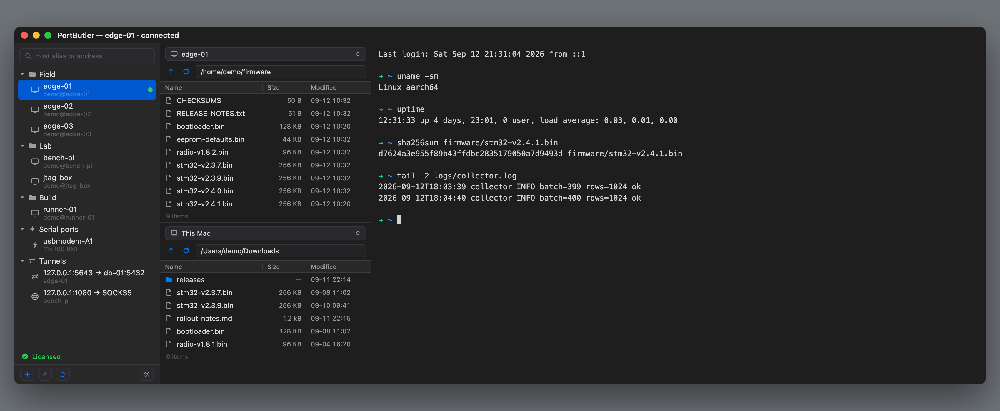
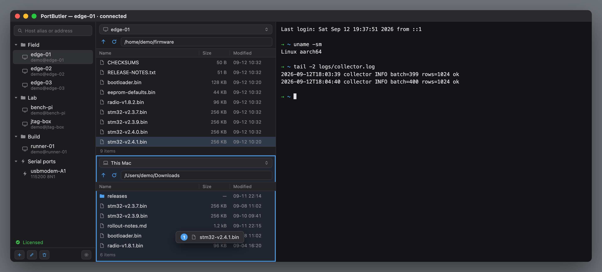
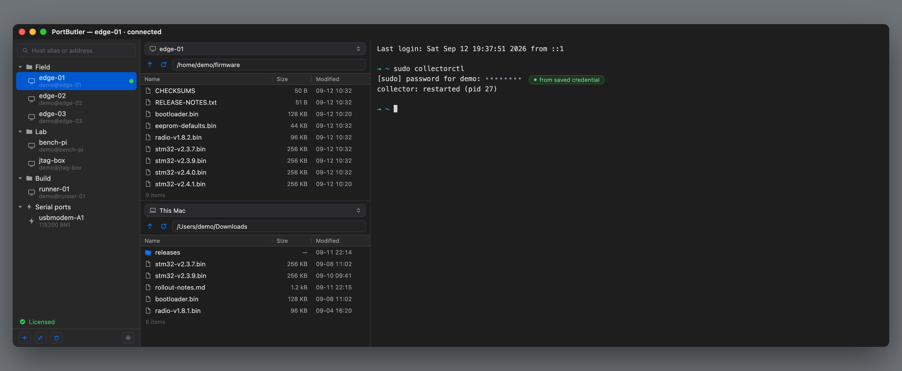
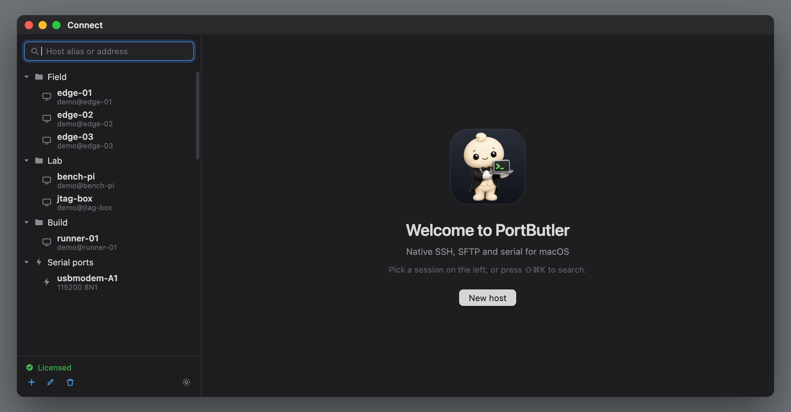

<p align="center">
  
</p>

<h1 align="center">PortButler</h1>

<p align="center">
  <b>Native SSH, SFTP and serial for macOS — in one window.</b>
</p>

<p align="center">
  <a href="https://github.com/Higangssh/portbutler-releases/releases/latest"><b>↓ Download</b></a>
  &nbsp;·&nbsp;
  <a href="#pricing">Pricing</a>
  &nbsp;·&nbsp;
  <a href="#how-it-compares">Compare</a>
  &nbsp;·&nbsp;
  <a href="#speed-measured--not-quoted">Benchmarks</a>
</p>

<p align="center">
  
  
  
  
</p>

<br>

<p align="center">
  
</p>


<p align="center">
<i>Pick a host on the left and it opens as a <b>tab in this window</b>.<br>
Five machines means five tabs — not five windows.</i>
</p>

---

## Why another SSH client?

Most SSH clients make you choose: a terminal that cannot move files, or a file
manager that cannot give you a shell. And none of them speak to the USB-serial
adapter on your desk.

PortButler puts all three in one window — and it does three things that the
others do not.

<br>

### 1 · It is measurably faster at moving files

**108 MB/s over gigabit, where `scp` gets 74.**

Same Mac, same server, same 64MB file:

| | Raspberry Pi 5 over 1GbE | Same machine (no wire limit) |
|---|---|---|
| **PortButler** | **108 MB/s** | **465 MB/s** |
| `scp` | 74 MB/s | 267 MB/s |
| `sftp` | 74 MB/s | 267 MB/s |
| | **1.45×** | **1.74×** |

The reason is not micro-optimisation. It is the shape of the transfer:

```
scp / sftp     [req]→ ⋯wait⋯ ←[data]  [req]→ ⋯wait⋯ ←[data]
               32 KiB per round trip, 0.43 ms each
               ceiling = 32 KiB ÷ 0.43 ms ≈ 74 MB/s

PortButler     [req][req][req][req] → responses interleave back
               4 streams · 256 KiB chunks · each written in place
```

**Round-trip latency is the ceiling**, and `scp` sits exactly on it — its
measured 74 MB/s matches the calculated limit, which is how we know the
explanation is right.

**The gap widens with distance.** A server on the other side of the world
(200 ms) leaves a sequential transfer crawling; a parallel one barely notices.

<p align="center">
  
</p>

<p align="center">
<i>Two file panes, either one remote or local. Drag a file from one to the other
— or sort by a column and move it without touching the mouse.</i>
</p>

#### Against other SFTP clients

`scp` is the baseline everyone has. Here is where we sit against the clients
people actually shop against — compared on **wire-unconstrained conditions**,
because that is the only way the client's own code is what is being measured:

| | Download | Upload |
|---|---|---|
| **PortButler** | **465 MB/s** | 267 MB/s |
| WindTerm 1.72 | 216 MB/s | 247 MB/s |
| FileZilla | 161 MB/s | 172 MB/s |
| WinSCP | 64 MB/s | 57 MB/s |

**Read this as orders of magnitude, not a precise ranking.** Ours is an Apple
silicon Mac; the others were published on Windows 10 with a 2.3 GHz Core i5, so
the machines differ. We include it because the alternative — leaving it out —
tells you less, and because the shape of the result matches the mechanism:
clients that pipeline requests land in the hundreds, clients that do not land
near `scp`. [Their published figures](https://kingtoolbox.github.io/2023/11/15/benchmark-sftp-transfer/)

**Why not compare on gigabit?** WindTerm's 216 MB/s cannot happen on a 1GbE
wire (max 119 MB/s), so it was measured on a faster link or inside one machine.
Putting our 108 MB/s beside it would make us look half as fast while actually
comparing *cables*, not code.


<br>

### 2 · It tells you *why* a connection failed

`connection failed` is not an error message. These five look identical and need
completely different fixes:

| What happened | What PortButler tells you |
|---|---|
| Port refused the connection | The machine is up. Check the port — many devices use 2222 |
| No answer at all | Powered off, or a firewall dropping packets silently |
| Name will not resolve | Check spelling, or whether it only exists on a VPN |
| Connected, but no SSH greeting | That port is not SSH, or `sshd` is stuck |
| Something answered, but not SSH | Check the port — a web server may be sitting there |

<br>

### 3 · It does not lock you out of your own accounts

Servers count failed logins. `MaxAuthTries` disconnects you, `pam_faillock`
locks the account, and `fail2ban` blocks your whole IP — which locks you out of
**every** account on that machine.

Most clients cheerfully offer every key in your agent, burn through the
allowance, and get cut off **before you are ever asked for a password**.

PortButler counts too. It offers **at most four public keys**, so an attempt is
always left for a password. It skips methods the server says it will not accept,
warns before a password attempt that could lock the account, and spaces out
reconnects.

<p align="center">
  
</p>

<p align="center">
<i>And when the far side asks for a password mid-session, it can answer from a
credential you saved in the Keychain — instead of you retyping it.</i>
</p>

---

## It uses the SSH you already have

- Reads `~/.ssh/known_hosts` — servers you already trust in Terminal are trusted
  here, and a key change is caught by both tools.
- Uses `ssh-agent` and your existing keys. Nothing is copied into a private store.
- Imports `~/.ssh/config` when you ask it to, and **never writes to that file**.

---

## Speed, measured — not quoted

Other clients publish transfer benchmarks. **Copying those numbers into one
table would be a lie**: different hardware, different network, different file
size. A table that puts a gigabit-wired result next to a Wi-Fi one is
advertising, not data.

So every number above was measured here, on one Mac, and **you can measure it
again yourself** — the commands are in [BENCHMARK](docs/BENCHMARK.ko.md) *(Korean)*.

<details>
<summary><b>Test conditions</b></summary>

<br>

| | |
|---|---|
| Client | Mac (Apple silicon), macOS 26.6 |
| Server | Raspberry Pi 5, Ubuntu 24.04, OpenSSH |
| Network | Wired 1GbE, 0.65 ms round trip (theoretical max ≈ 119 MB/s) |
| Second condition | `localhost` — removes the wire limit, shows the CPU ceiling |
| Compared against | OpenSSH 10.3p1 (`scp`, `sftp`) — the macOS default |
| File | 64 MB of random bytes (so compression cannot flatter anyone) |
| Runs | 3 each; the table shows observed values |

That 108 MB/s is **91% of the theoretical 1GbE maximum**. There is no room left
to win on that wire — which is exactly why the same-machine column exists.

</details>

<details>
<summary><b>What we are <i>not</i> faster at — the honest list</b></summary>

<br>

**Uploads are still sequential.** They match `scp`, not beat it. The same
parallel design would work, but writing to several places in one remote file
leaves a **hole-ridden file** if the transfer dies midway. Not shipping that
until it is handled properly — unbroken beats fast.

**Small files show no difference.** Parallelism hides round-trip latency; with
only a few round trips there is nothing to hide.

**A slow server erases the gap.** A Pi 5 encrypts fast enough, but on a weaker
board the server's CPU is the bottleneck, not the client.

**A saturated wire erases it too.** We already use 91% of gigabit. On that link
no client can be meaningfully faster — the remaining 9% is protocol overhead.

</details>


<br>

### The terminal has a different bar

Throughput alone is meaningless for a terminal — you can always make it look
good with a bigger buffer. What matters is whether **the screen keeps up while
the bytes arrive**.

| | Target | Result |
|---|---|---|
| Throughput | ≥ 50 MB/s | ✅ passed |
| Frame budget (drain p99) | ≤ 8.33 ms — one frame at 120Hz | ✅ passed |
| Data loss | none, ever | ✅ zero |

The 99th percentile matters, not the average: **one stutter in a hundred is
still visible.** And when the buffer fills, PortButler slows the sender down
rather than dropping bytes — a line that vanishes from a log is worse than a
slow one, because you never learn it was there.

---

## How it compares

WindTerm is free and does more things. Termius syncs across your devices. We are
not trying to win on feature count — the difference is in character.

| | PortButler | WindTerm | Termius |
|---|---|---|---|
| SSH · SFTP · serial in one window | ✅ | ✅ | ✅ |
| macOS native | ✅ | cross-platform toolkit | ✅ |
| Reads your `~/.ssh` directly | ✅ | — | sandboxed (App Store) |
| Tells you *why* a connection failed | ✅ | — | — |
| Counts auth attempts so servers do not lock you out | ✅ | — | — |
| Parallel SFTP download | ✅ | ✅ | — |
| Price | **$29 once** | free | subscription |

The full comparison — **including what these tools do better than us** — is in
[COMPARISON](docs/COMPARISON.ko.md) *(Korean)*, with sources and the date checked.

---

## Features

<p align="center">
  
</p>

<p align="center">
<i>The window you land on. Saved sessions on the left; ⇧⌘K searches them.</i>
</p>

**Sessions** — groups, aliases, notes, and jump chains that reference hosts by
**ID**, so renaming a bastion never breaks the chain. Everything lives in one
JSON file you can carry to another Mac.

**SFTP** — drag and drop both ways, edit remote files in your own editor with
saves uploaded automatically, and downloads that never silently overwrite.

**Serial** — `/dev/cu.*` detected automatically, speed and framing picked at
connect time, XMODEM/YMODEM transfers, control lines, and a hex mode for binary
protocols.

**Session logging** — timestamped, rotating, on both SSH and serial, with no
measurable cost to throughput.

**Reliability** — keepalives so idle sessions do not drop, and reconnection that
knows when **not** to retry: authentication failures and host key changes are
never retried automatically.

**Both languages** — English and Korean, switchable in the app, independent of
the system language.

### Shortcuts

| | |
|---|---|
| `⌘K` | Clear screen including scrollback — **sends nothing to the remote** |
| `⇧⌘K` | Jump to session search |
| `⌥⌘S` · `⌥⌘F` | Toggle session list · file list |
| `⌘T` · `⌘N` | New tab · new window |
| `⌘L` · `⇧⌘L` | Start · stop session logging |
| `⌘B` | Send Break *(serial)* |
| `⌘R` | Pulse DTR — reset the board *(serial)* |
| `⌥⌘X` | Binary (hex) mode *(serial)* |

---

## Pricing

<h3 align="center">$29 &nbsp;·&nbsp; one time</h3>

<p align="center">
No subscription. Every Mac you own. Free minor updates.
</p>

**14-day trial** — no account, no credit card. When the trial ends PortButler
stops connecting, but **your session list stays yours**: you can still open,
edit and export it. We are not holding your own data hostage to sell you
something.

---

## Requirements

macOS 13 or later. Universal — Apple silicon and Intel.

## Not on the Mac App Store

App Store apps are sandboxed, and a sandboxed app **cannot write
`~/.ssh/known_hosts`**. That file is how SSH tells you the server you are
talking to is the one you talked to yesterday — the single protection the
protocol gives you against interception. We would rather ship outside the store
than ask you to give that up.

The app is **signed with a Developer ID and notarized by Apple**, so it opens
normally. No right-click-to-open, no scary warnings.

<br>

---

<p align="center">
  
</p>
<p align="center">
  <sub>This repository hosts releases and the update feed.<br>
  Made in Seoul.</sub>
</p>
